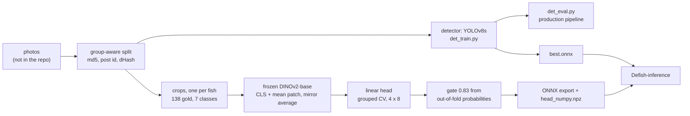
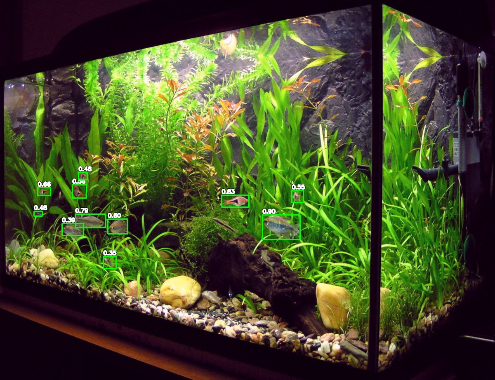
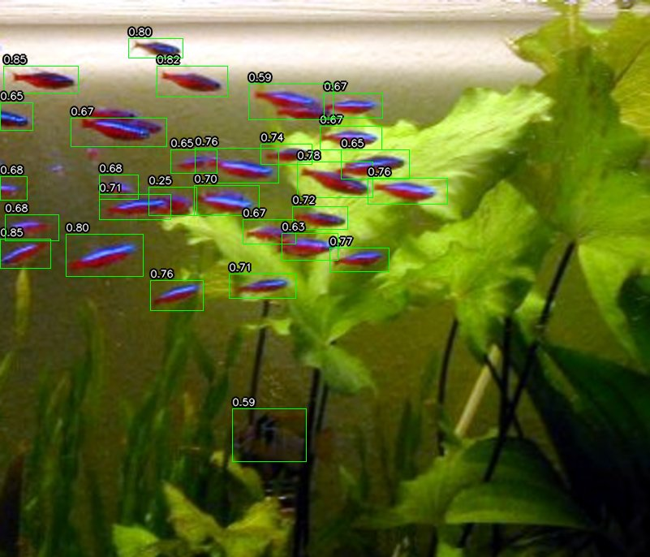
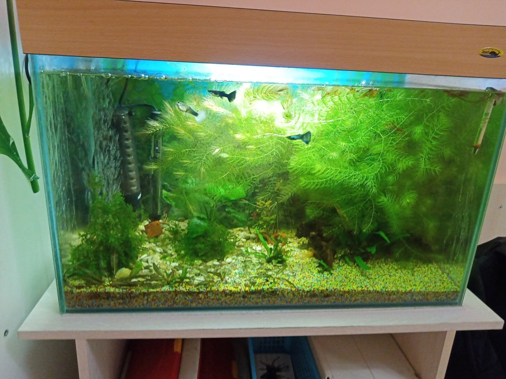
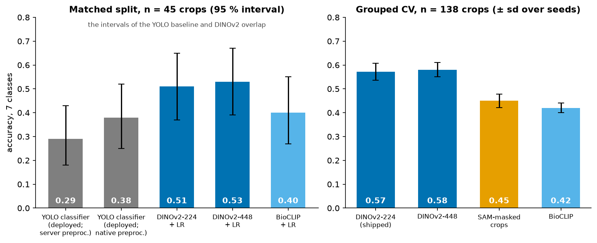
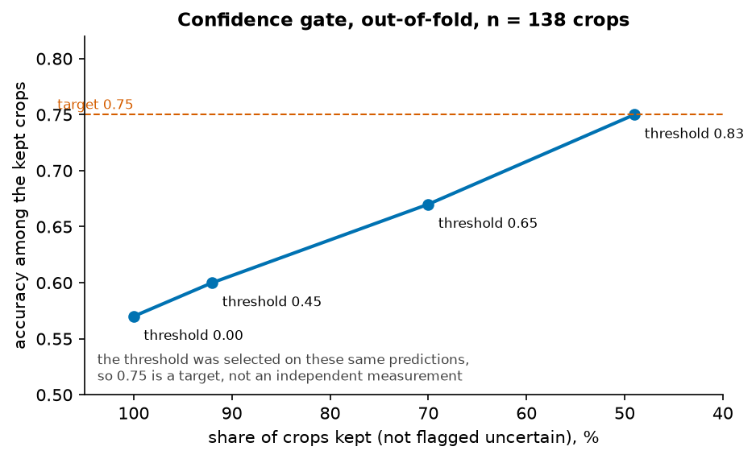
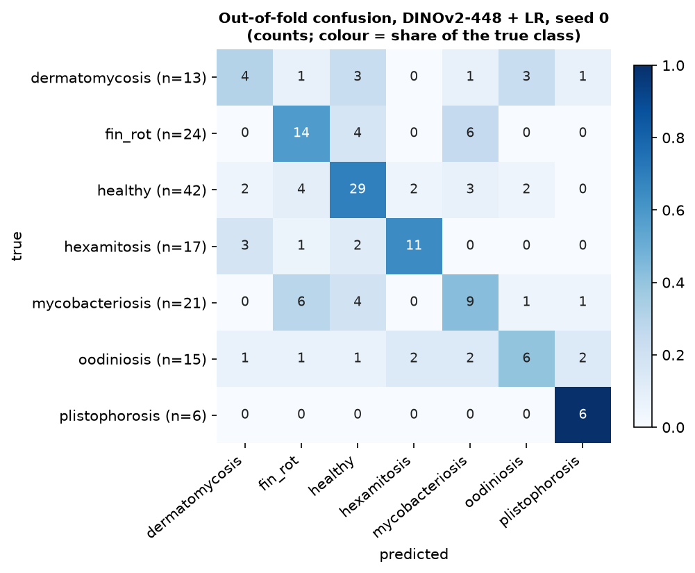
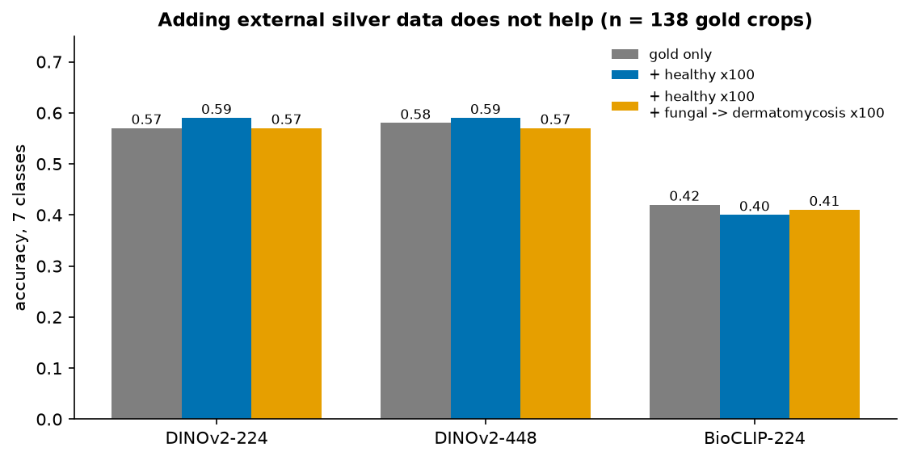
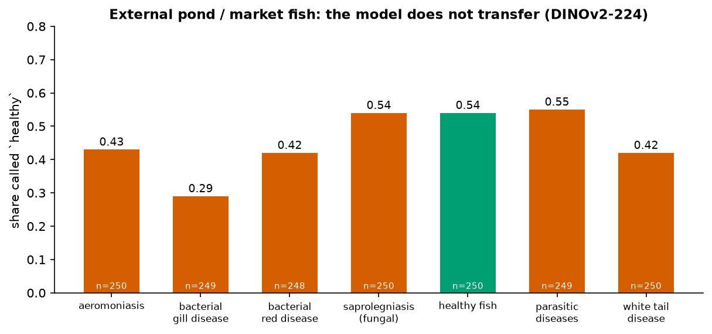
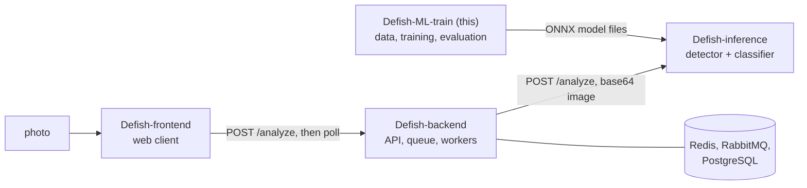

# Defish ML Training

Data work, training and leak-free evaluation of the two models behind [**Defish**](https://defish.katzer.ru/), a system that finds fish in aquarium photos and flags visible signs of disease: a YOLOv8s **detector**, and a **classifier** made of a frozen DINOv2 embedding, a linear head and a confidence gate. This repository records how the models were built and what honest evaluation showed, negative results included. The serving side is in [`Defish-inference`](https://github.com/GKatzer/Defish-inference).

> **Not a veterinary tool.** The classifier tells seven conditions apart from 138 labelled crops: about 57% accuracy (top-3 84%), with a 95% interval of roughly ± 8 points. Its output is a hint, not a diagnosis.


*What honest evaluation changed. Left: the detector in production looked good on the images of its own old split (AP50 0.74) and fell to 0.41 on images it had not seen; on the 117 leak-free test images it had never seen, the replacement scores 0.72 against 0.42 (95% bootstrap interval of the difference +0.23 to +0.37). Right: the frozen-embedding classifier is ahead of the deployed one on 45 unseen crops, but the 95% intervals overlap, so the size of the gap is not established. Numbers typed from the reports by [`docs/figures/make_figures.py`](docs/figures/make_figures.py); the data are not in this repository.*

**Try it:** [Quick start](#quick-start) checks the data and evaluation plumbing on synthetic data in a minute (no private data needed) and runs the classifier on a crop.

## What this project demonstrates

- **Evaluation that survives scrutiny.** Images that share a post, are byte-identical or look alike are merged into groups, and whole groups go to one split. This showed that the detector in production had memorised its data (AP50 0.74 on its old split, 0.41 on unseen images); its replacement reaches AP50 0.66 against 0.55 on a leak-free test split of 165 images and 292 fish. [Experiments E1 and E2](docs/experiments.md#detector)
- **A classifier honest about 138 crops.** Frozen DINOv2-base embeddings and a logistic regression, evaluated with grouped cross-validation: accuracy 0.57 ± 0.04, top-3 0.84. Predictions below a 0.83 confidence gate are flagged `uncertain`: out-of-fold, the gate keeps 49% of crops at about 75% accuracy (a tuned target, not an independent measurement). [E7, E10](docs/experiments.md#classifier)
- **A confound found and only partly fixed.** All six `plistophorosis` crops were neon tetras and no healthy crop was; five external healthy-tetra crops cut the mislabelled healthy tetras from 3 of 5 to 1 of 5. [E9](docs/experiments.md#e9-the-species-confound)
- **Negative results kept, with numbers.** Resolution 1280 px, tiled inference, self-training, SAM-masked crops, BioCLIP embeddings and external silver data were all tried and not adopted. [Table](#results)
- **Honest about what was checked.** Every script compiles, the scripts with a command line print their help, and the data and evaluation plumbing was run end to end on synthetic data; the training and evaluation on the real data were **not** re-run for this documentation. [What was checked](docs/reproducing.md#what-was-checked)

## Contents

[Idea](#idea) · [History](#history) · [What is in the repository](#what-is-in-the-repository) · [How it works](#how-it-works) · [Results](#results) · [Quick start](#quick-start) · [Usage examples](#usage-examples) · [Configuration](#configuration) · [Command-line reference](#command-line-reference) · [Repository layout](#repository-layout) · [Tests and quality](#tests-and-quality) · [Deployment](#deployment) · [Limitations](#limitations) · [Related repositories](#related-repositories) · [License](#license)

Further reading in `docs/`:

| File | What is there |
|---|---|
| [docs/experiments.md](docs/experiments.md) | all fifteen experiments: question, method, result with its sample size, verdict |
| [docs/data.md](docs/data.md) | datasets, labels, grouping and duplicates, gold and silver data, the folder layout the scripts expect, provenance and licences |
| [docs/design-decisions.md](docs/design-decisions.md) | nine decisions with the alternatives, and the open questions |
| [docs/reproducing.md](docs/reproducing.md) | setup, paths, the order of the scripts, the command-line reference, what was and was not checked |
| [experiments/detector/README.md](experiments/detector/README.md), [experiments/classifier/README.md](experiments/classifier/README.md), [experiments/results/report.md](experiments/results/report.md) | the original reports the numbers come from |
| [experiments/open_datasets_survey.md](experiments/open_datasets_survey.md) | a survey of open datasets |
| [archive/2025-exploration/](archive/2025-exploration/README.md) | the first phase: notebooks with local paths, not reproducible |

## Idea

A deployed system can look fine for the wrong reasons. In this project the detector in production had been scored on images from its own training split, and the disease classifier had been evaluated on a set with duplicate copies and with the same images in two folders. The 2026 work rebuilt the evaluation first, and only then compared models:

1. **Group-aware splits.** Near-copies never sit on both sides of a split, so a score measures generalisation, not memory.
2. **The production pipeline as the yardstick.** The detector is evaluated through the inference service's own code (letterbox to 960 px, white padding, confidence 0.25), not through a nearby approximation.
3. **A small, careful classifier.** 138 labelled crops cannot train a network; a frozen general embedding with a linear head has few parameters to overfit, and a gate lets it say "not sure".
4. **Every idea gets a verdict.** Hypotheses that did not help are listed next to the ones that did.

## History

The project began as a diploma project in 2025, with a mobile client and a first set of models; in 2026 the evaluation was rebuilt to be leakage-free, and this repository records what that showed. The dates below are those the repository itself records (file labels, commit dates, report titles).

| When | What |
|---|---|
| May 2025 | the first detector (`yolo.pt`, the "old server" model in `det_eval.py`) |
| 7 and 9 September 2025 | retrained detectors (`detector.onnx`, `new_colab.onnx`, `nout.pt`), kept as baselines in `det_eval.py` |
| 18 September 2025 | first commit of this repository: the exploration notebooks, now in [`archive/`](archive/2025-exploration/README.md) |
| September 2026 | the evaluation is rebuilt: leak-free splits, the production-pipeline evaluation, a new detector (exported 22 September), the frozen-embedding classifier with a confidence gate, the SAM experiment (22 September) and the survey of open datasets |

## What is in the repository

**Data work**
- `experiments/detector/build_splits.py` pools three hand-labelled detector sets (1069 images) and splits them by group (md5, post id, dHash distance of at most 6). [Details](docs/data.md#detector-data)
- `experiments/clf_frozen_vs_yolo.py` rebuilds the classifier set without `dup_` copies and without the valid/test overlap (187 unique crops, 138 in the seven gold classes) and runs the comparisons of the report.

**Detector**
- `det_train.py` trains YOLOv8s on the leak-free splits; `det_eval.py` evaluates any detector under the production pipeline (AP50, precision and recall at 0.25, false positives per image, recall by fish size); `pseudo_label.py` is the self-training experiment that did not pay off. [Detector report](experiments/detector/README.md)

**Classifier**
- `train_final.py` trains the frozen-embedding classifier, estimates it with grouped cross-validation and picks the confidence gate; `export_onnx.py` and `finalize_onnx_artifacts.py` export it so that serving needs only `onnxruntime` and NumPy; `infer_onnx.py` is that runtime; `infer.py` is the PyTorch reference; `sam_crop_experiment.py` is the rejected SAM idea. [Classifier report](experiments/classifier/README.md)

**Support**
- `experiments/paths.py` takes every data and model location from environment variables ([configuration](#configuration)); `docs/figures/make_figures.py` redraws the figures; `docs/examples/synthetic_detector_data.py` writes a synthetic dataset for checking the plumbing.

## How it works



The decisions and what they were chosen over ([all nine](docs/design-decisions.md)):

| Decision | Short reason |
|---|---|
| evaluate on groups, never on random splits | the old evaluation measured memory: AP50 0.74 on its own split, 0.41 unseen |
| evaluate through the production pipeline | a number from a different preprocessing is not the number a user gets |
| a frozen embedder and a linear head | 138 crops cannot train a network; few parameters to overfit |
| report cross-validation, ship a model fitted on all data | gold data are too scarce to hold any out |
| seven classes and an `uncertain` flag | the helper classes took signal from the real ones and silently swallowed bad crops |
| silver data only if it helps the gold estimate | a rule fixed in advance; the external set did not help |
| export so that serving needs no PyTorch | the service runs on `onnxruntime` and NumPy only |

## Results

All numbers are those of the reports in this repository; the data are not in it, so none was recomputed ([experiments.md](docs/experiments.md)). Intervals are the reports' 95% intervals; "sd" is over seeds.

**Detector** (leak-free test split, 165 images and 292 fish, production pipeline: letterbox 960, confidence 0.25, NMS IoU 0.45)

| Model | AP50 | Precision | Recall | False positives per image |
|---|---|---|---|---|
| previously deployed | 0.55 | 0.69 | 0.55 | 0.44 |
| YOLOv8s, pretrained, train only | 0.66 | 0.69 | 0.64 | 0.50 |
| YOLOv8s, pretrained, train + validation (shipped) | **0.66** | 0.73 | 0.62 | **0.40** |

The biggest gain is on close-ups of sick fish (AP50 0.51 → 0.92 and 0.44 → 0.75 on two subsets), a domain the old model never saw. **Small fish remain the weak spot**: recall under 64 px is about 0.3 to 0.45 (62 test fish between 24 and 64 px, 30 under 24 px: noisy), and more data of the same kind did not move AP50. Production-pipeline examples on three public photos, one of them a miss (three guppies in view, no box):

|  |  |  |
|---|---|---|

*The detector trained here, run by the inference service on 2026-10-04 (11 boxes, 29 boxes, none); the number is the detector score; sources in [CREDITS](docs/media/CREDITS.md). These are single photos, not a rate.*

**Classifier** (seven classes)

| Approach | Accuracy | n | Note |
|---|---|---|---|
| frozen DINOv2-base + logistic regression, 224 px (**shipped**) | **0.572 ± 0.036**, top-3 **0.841** | 138 crops, grouped CV 4 × 8 | 95% interval about ± 8 points |
| the same, 448 px | 0.58 (sd 0.03) | 138 | tie; the smaller input was kept |
| the same with BioCLIP | 0.42 (sd 0.02) | 138 | not adopted |
| SAM-masked crops | 0.450 ± 0.028 | 138 | hurts `fin_rot` (recall 0.56 → 0.35) |
| the earlier YOLO classifier, native preprocessing | 0.38 [0.25, 0.52] | 45 unseen crops | DINOv2-224 scores 0.51 [0.37, 0.65] on the same crops: **the intervals overlap**, so the size of the difference is not established |



*Left: the matched split of [E6](docs/experiments.md#e6-frozen-embeddings-against-the-deployed-yolo-classifier). Right: grouped cross-validation of [E7](docs/experiments.md#e7-which-embedder) and [E11](docs/experiments.md#e11-sam-masked-crops); the shipped model's bar is its 4 × 8 estimate, the others come from a 4 × 5 run, so the bars are close in method but not identical.*

**The confidence gate** (out-of-fold predictions, the same ones the threshold was chosen on)

| Threshold | Crops kept | Accuracy among the kept |
|---|---|---|
| 0.00 (always answer) | 100% | 0.57 |
| 0.45 | 92% | 0.60 |
| 0.65 | 70% | 0.67 |
| **0.83 (shipped, target 0.75)** | **49%** | **0.75** |



*The threshold was selected on these predictions, so 0.75 is a target the threshold was tuned to reach, not an independently measured accuracy.*



*Out-of-fold confusion of the DINOv2-448 model (seed 0, 138 crops), from the report; this is the 448 px variant of the comparison, not the shipped 224 px model. `plistophorosis` is perfect (6 of 6), which is what the species confound (all six were neon tetras) would be expected to produce.*

**Tried and not adopted** ([details and numbers](docs/experiments.md))

| Idea | Result | Verdict |
|---|---|---|
| detector at 1280 px | AP50 0.65, 1.8 times the cost; 0.58 at inference only | no gain |
| tiled inference | tiny-fish recall 0.43 → 0.60, false positives per image 0.5 → 1.1, AP50 unchanged | no gain |
| self-training the detector | 199 of 1781 unlabelled photos accepted, all easy large fish | not trained |
| SAM-masked classifier crops | accuracy 0.45 against 0.57; the masks clip fins | worse |
| BioCLIP embeddings | 0.42 against 0.57 | worse |
| external silver data | within seed noise (0.57 → 0.57 to 0.59); the external domain does not transfer (only 54% of its healthy fish are called healthy) | discarded |
| a species-confound fix | healthy tetras called `plistophorosis`: 3 of 5 → 1 of 5 | partial |





*The silver-data experiment (n = 138 gold crops, [E12](docs/experiments.md#e12-external-silver-data-as-training-data)) and the probe of the gold-trained model on about 250 external images per class.*

## Quick start

Python 3.12 (tested on 3.12.3). Commands below were run on 2026-10-05 in a clean environment (`pip install -r requirements.txt`, CPU `torch`); the training and evaluation on the real data were **not** run, because the data are not in the repository.

**1. Check the plumbing without data.** A synthetic dataset (random noise with drawn rectangles) in the expected layout, the group split, and the evaluation through the production pipeline with a constant stand-in detector. `DEFISH_INFERENCE_DIR` must point at a checkout of [`Defish-inference`](https://github.com/GKatzer/Defish-inference):

```bash
export DEFISH_DATA_DIR=/tmp/defish-data DEFISH_INFERENCE_DIR=../Defish-inference
python docs/examples/synthetic_detector_data.py --standin-detector /tmp/standin_detector.onnx
python experiments/detector/build_splits.py
python experiments/detector/det_eval.py --model /tmp/standin_detector.onnx --tag standin --backend prod-white --splits valid test
```

```text
images=94 groups=60
                    images  boxes  empty
source       split
ds_v2        test       10     39      0
             train      34    117      0
             valid      10     36      0
...
standin          ALL     16    39  0.00 0.00 0.00        2.00    0.00  ...
```

The AP50 of 0.00 is right: the stand-in detects nothing real. What the run shows is that the paths, the grouping (byte-identical images of different old splits ended up in one split) and the production-pipeline backend work. [Full transcript](docs/examples/transcripts/synthetic-smoke-test.txt)

**2. Run the classifier on a crop.** `infer_onnx.py` needs only `onnxruntime`, NumPy and Pillow and the four files of a trained model in `experiments/classifier/artifacts/` (`embedder_dinov2_base.onnx` with its `.onnx.data`, `head_numpy.npz`, `meta.json`; not in the repository, copy them from the service's `models/disease_classifier/`):

```bash
python experiments/classifier/infer_onnx.py crop1.jpg crop2.jpg
```

```text
crop1.jpg -> {'label': 'healthy', 'confidence': 0.9996, 'uncertain': False, 'top3': [{'label': 'healthy', 'confidence': 0.9996}, {'label': 'fin_rot', 'confidence': 0.0003}, {'label': 'plistophorosis', 'confidence': 3.6e-05}]}
crop2.jpg -> {'label': 'healthy', 'confidence': 0.9887, 'uncertain': False, 'top3': [...]}
```

(Two fish cut from a public-domain aquarium photo; floats rounded for reading; the true condition of those fish is not known.)

**3. Redraw the figures:**

```bash
pip install matplotlib && python docs/figures/make_figures.py      # writes docs/media/*.png
```

**4. With the data** (*not run here*). Data will be published: <!-- TODO: insert the link to the published data --> Put the datasets under `DEFISH_DATA_DIR` ([layout](docs/data.md#folder-layout-the-scripts-expect)) and follow the [order of the scripts](docs/reproducing.md#order-of-the-scripts).

## Usage examples

```bash
# which paths will the scripts use?
python experiments/paths.py

# evaluate a detector under the production pipeline (needs the data and the inference service checkout)
python experiments/detector/det_eval.py --model runs/fish_det/v8s_pre_all/weights/best.onnx --tag v8s --backend prod-white

# train the detector on the leak-free splits (needs a GPU)
python experiments/detector/det_train.py --name v8s_pre_all --weights yolov8s.pt
```

The classifier from Python, with the same files as in the quick start:

```python
from PIL import Image
from experiments.classifier.infer_onnx import FishDiseaseClassifierONNX   # run from the repository root

clf = FishDiseaseClassifierONNX("experiments/classifier/artifacts")
print(clf.predict(Image.open("crop1.jpg")))   # {'label', 'confidence', 'uncertain', 'top3'}
```

Resize crops with Pillow's `Image.BICUBIC` if you write your own runtime: another resize moves confidences ([decision 8](docs/design-decisions.md#8-export-so-that-serving-needs-no-pytorch)).

## Configuration

Environment variables, read by [`experiments/paths.py`](experiments/paths.py) (nothing else needs editing):

| Variable | Meaning | Default |
|---|---|---|
| `DEFISH_DATA_DIR` | root of the datasets ([layout](docs/data.md#folder-layout-the-scripts-expect)) | `./data` |
| `DEFISH_RUNS_DIR` | detector training runs | `./runs` |
| `DEFISH_MODELS_DIR` | baseline weights of `det_eval.py`; `det_train.py` runs from here | `./models` |
| `DEFISH_INFERENCE_DIR` | checkout of the inference service (production pipeline, `models/best.onnx` baseline) | `../Defish-inference` |
| `DEFISH_DEPLOYED_CLASSIFIER` | the old YOLO classifier, baseline of `clf_frozen_vs_yolo.py` | `./models/fish_classifier.pt` |
| `HF_HOME` | Hugging Face cache; the scripts do not set it | library default |

Constants at the top of the scripts: `FRACTION` (0.15 and 0.15) and `SEED` in `build_splits.py`; `SEEDS` (8), `FOLDS` (4), `TARGET_PRECISION` (0.75), `EMBEDDER` and `AUX` in `train_final.py`; `A_CONF`, `B_CONF`, `CONFLICT_CONF` in `pseudo_label.py`.

## Command-line reference

`det_eval.py`: `--baselines`, or `--model PATH --tag NAME [--backend ultra|prod-white|prod-gray] [--imgsz 960]`, `--splits valid test`. `det_train.py`: `--name` (required), `--weights`, `--data`, `--imgsz`, `--epochs`, `--batch`, `--patience`. `pseudo_label.py`: `--teacher-a` (required), `--teacher-b`. The other scripts take no options. Full table: [docs/reproducing.md](docs/reproducing.md#command-line-reference).

## Repository layout

```text
experiments/
  paths.py                    where data and weights are (environment variables)
  detector/                   build_splits.py, det_train.py, det_eval.py, pseudo_label.py, README.md (the report)
  classifier/                 train_final.py, export_onnx.py, finalize_onnx_artifacts.py, infer.py, infer_onnx.py,
                              sam_crop_experiment.py, README.md, SAM_EXPERIMENT_RESULT.md, artifacts/meta.json
  clf_frozen_vs_yolo.py       classifier set rebuild and the embedder comparison
  probe_deployed_on_external.py   how the deployed YOLO classifier treats external images
  results/report.md           the comparison tables (A, B, C1, C2, confusion matrices)
  open_datasets_survey.md     survey of open datasets
docs/
  experiments.md, data.md, design-decisions.md, reproducing.md
  figures/make_figures.py     figures from the numbers of the reports
  examples/                   synthetic_detector_data.py, transcripts/
  media/                      figures, example pictures, CREDITS.md
archive/2025-exploration/     the first phase: notebooks with local paths (not reproducible)
requirements.txt, LICENSE
```

## Tests and quality

There is **no automated test suite**. What was checked, on 2026-10-05: every script compiles; the scripts with a command line print their help; `build_splits.py` and `det_eval.py` run end to end on synthetic data; `infer_onnx.py` runs on real crops with the deployed files; the figure script runs ([table](docs/reproducing.md#what-was-checked)). Not checked: training and evaluation on the real data, the exports, the SAM experiment, pseudo-labelling.

## Deployment

The outputs that the inference service uses are four files from `experiments/classifier/artifacts/` (`embedder_dinov2_base.onnx` with `.onnx.data`, `head_numpy.npz`, `meta.json`) and the exported detector (`best.onnx`); copy them into the service's `models/` and `models/disease_classifier/` and restart it. Re-run `train_final.py`, `export_onnx.py` and `finalize_onnx_artifacts.py` together after any retraining. The weights are not in this repository.

## Limitations

- **The data are not here.** The photographs are third-party and are not redistributed, so the evaluations and the training cannot be re-run from a clone; the numbers are those of the reports, not recomputed. Data will be published: <!-- TODO: insert the link to the published data --> The scripts read their locations from environment variables, but were not run on data after that change.
- **Small samples.** 138 crops of seven classes (about ± 8 points), 45 crops for the matched comparison, 165 test images for the detector. Differences of a few points are noise; the YOLO-against-DINOv2 gap has overlapping intervals.
- **The species confound is only partly fixed**, and the other diseases were not checked for it.
- **The confidence gate is tuned, not validated**: 0.83, 49% and 0.75 come from the same predictions, and 0.75 is not tied to a product requirement.
- **Small fish.** Detector recall under 64 px is about 0.3 to 0.45.
- **Mixed estimates in one chart.** The shipped model's cross-validation (4 × 8) and the comparison runs (4 × 5) differ in seeds; the confusion matrix shown is the 448 px variant.
- **No test suite, no pinned versions.** The experiments ran with versions that were not recorded.
- **The 2025 notebooks are not reproducible** (local paths, saved outputs).

**Roadmap** (open questions, not promises): more labelled small fish for the detector; more varied healthy-tetra photos and a species check for the other diseases; a gate target derived from a requirement; fp16 or int8 for the 348 MB embedder.

## Related repositories

**Defish** finds fish in aquarium photos and flags visible signs of disease. It is built from four repositories: the data work and evaluation of the models, the inference service that serves them, an asynchronous API in front of it, and a web client.



| Repository | Role |
|---|---|
| `Defish-ML-train` (this) | data work, training and leak-free evaluation of the detector and the classifier; produces the model files |
| [`Defish-inference`](https://github.com/GKatzer/Defish-inference) | inference service: letterboxed YOLOv8s detector and DINOv2 + linear classifier on ONNX Runtime, with a confidence gate |
| [`Defish-backend`](https://github.com/GKatzer/Defish-backend) | API: upload, task queue, workers, result cache, persistence |
| [`Defish-frontend`](https://github.com/GKatzer/Defish-frontend) | web client: upload, detections drawn over the photo, per-fish diagnosis |

Shared terms: a **detection** is a box around one fish; a **diagnosis** is one of seven classes (`healthy`, `fin_rot`, `dermatomycosis`, `hexamitosis`, `mycobacteriosis`, `oodiniosis`, `plistophorosis`);
**uncertain** marks a classification whose confidence is below the gate (0.83); **AP50** is average precision at an intersection-over-union of 0.5; a **leak-free split** groups images by source post, so that no tank appears on both sides.

Shared numbers (identical in all four READMEs; from `Defish-ML-train`): the detector reaches AP50 0.66 against 0.55 for the model it replaced, on a leak-free test split of 165 images with 292 fish, under the production pipeline (letterbox to 960 px, confidence 0.25, NMS IoU 0.45).
The classifier reaches accuracy 0.57 and top-3 accuracy 0.84 over 138 expert-checked crops (grouped cross-validation, 95 % interval about +/- 8 points). The gate at 0.83 keeps about half of the crops (49 %) at about 75 % accuracy among those kept; the threshold was chosen on the same out-of-fold predictions, so 0.75 is a target, not an independent measurement.

**Not a veterinary tool.** The output is a hint, not a diagnosis.

## License

MIT licence for the code; the weights trained here carry the licences of what they were built with (the detector with Ultralytics YOLOv8, AGPL-3.0; the embedder is DINOv2). Photographs: see [docs/media/CREDITS.md](docs/media/CREDITS.md).

License: MIT, see LICENSE.
Author: George Denisov · [GitHub](https://github.com/GKatzer) · [Telegram](https://t.me/denisov_george)
